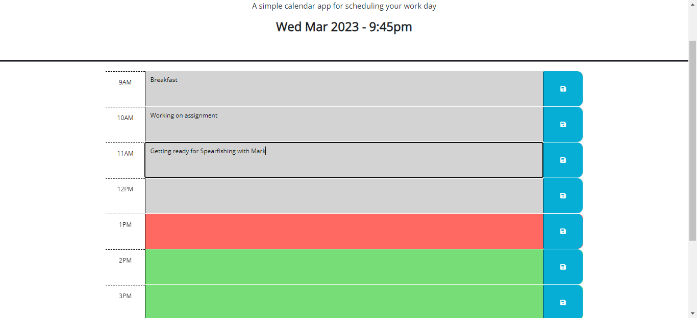

# Work-Day-Scheduler

## Description

This site creates a simple daily calendar in which you can save your tasks per hour.
Color coding help visualize what is in the past and what is in the future.

## Usage

Simply enter the event in the correct time slot then click the save button.
The event are saved in the local storage. 

If you wish to modify an event simply type new event then click the save button again.

The time slots are color coded: 
- Grey is in the past
- Red is the current time slot
- Green is in the future

  

## Deplayed application Link

https://gator2-0.github.io/Work-Day-Scheduler/

## Tests

To test the color coding feature simply modify the parameter of the updateColor function in Js